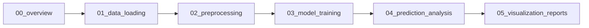

# 🌊 Coastal Assessment System using Sentinel-2 + 1D CNN

> **Hackathon Project**: Analyze satellite images to detect coastal damage (seagrass loss, shoreline erosion) and provide evidence-based recommendations for government agencies.


---

## 📋 Table of Contents

- [Overview](#overview)
- [Prerequisites](#prerequisites)
- [Installation Guide](#installation-guide)
- [Project Structure](#project-structure)
- [Quick Start](#quick-start)
- [Workflow](#workflow)
- [Troubleshooting](#troubleshooting)
- [Team Collaboration](#team-collaboration)

---

## 🎯 Overview

This system uses **Copernicus Sentinel-2** satellite imagery and a **1D Convolutional Neural Network** to:

- Calculate NDVI (Normalized Difference Vegetation Index)
- Classify coastal pixels into: Seagrass, Water, Sand, Cloud
- Track area changes over multiple years
- Generate evidence-based reports for policy makers

**Key Features:**

- ✅ Modular Jupyter notebooks (5 separate notebooks)
- ✅ Automated pixel classification
- ✅ 1D CNN for spectral analysis
- ✅ Multi-year trend analysis
- ✅ Area calculations in km²

---

## 🔧 Prerequisites

### System Requirements

- **OS**: Windows 10/11 (Mac/Linux also supported)
- **RAM**: 8GB minimum (16GB recommended)
- **Storage**: 2GB free space
- **Internet**: For downloading packages

### Required Software

1. **Python 3.12** (⚠️ Important: TensorFlow doesn't support Python 3.14+)
2. **Git** (for version control)
3. **VS Code** (recommended) or Jupyter Notebook

---

## 📥 Installation Guide

### Step 1: Check Your Python Version

```powershell
python --version
# OR
py --version
```

**⚠️ CRITICAL**: If you have Python 3.14, you MUST install Python 3.12 because TensorFlow doesn't support 3.14 yet.

### Step 2: Install Python 3.12 (if needed)

1. Download Python 3.12.8: https://www.python.org/downloads/release/python-3128/
2. Run installer and check:
   - ✅ "Add Python 3.12 to PATH"
   - ✅ "Install for all users" (optional)
3. Verify installation:
   ```powershell
   py -3.12 --version
   ```

### Step 3: Clone the Repository

```powershell
git clone <your-repo-url>
cd matlabTiff
```

### Step 4: Create Virtual Environment

**Why?** Keeps dependencies isolated and prevents conflicts.

```powershell
# Create virtual environment with Python 3.12
py -3.12 -m venv coastal_env

# Activate it
.\coastal_env\Scripts\activate

# You should see (coastal_env) in your terminal prompt
```

### Step 5: Install Required Packages

```powershell
# Upgrade pip first
python -m pip install --upgrade pip

# Install all dependencies
pip install numpy pandas matplotlib rasterio scikit-learn tensorflow ipykernel

# This will take 5-10 minutes (downloads ~500MB)
```

**Packages Installed:**

- `numpy` - Numerical computations
- `pandas` - Data manipulation
- `matplotlib` - Visualizations
- `rasterio` - Read satellite TIFF files
- `scikit-learn` - Machine learning utilities
- `tensorflow` - Deep learning (1D CNN)
- `ipykernel` - Jupyter notebook support

### Step 6: Register Jupyter Kernel

```powershell
python -m ipykernel install --user --name=coastal_env --display-name="Python 3.12 (Coastal CNN)"
```

This allows VS Code/Jupyter to use your virtual environment.

### Step 7: Verify Installation

```powershell
python -c "import tensorflow as tf; import numpy as np; print(f'✅ TensorFlow {tf.__version__}'); print(f'✅ NumPy {np.__version__}')"
```

**Expected Output:**

```
✅ TensorFlow 2.20.0
✅ NumPy 2.4.2
```

---

## 📁 Project Structure

```
matlabTiff/
├── coastalImage/              # Sentinel-2 satellite images
│   ├── B02.tiff              # Blue band
│   ├── B03.tiff              # Green band
│   ├── B04.tiff              # Red band
│   ├── B08.tiff              # NIR band
│   └── ...
├── outputs/                   # Generated results (created automatically)
│   ├── loaded_bands.pkl
│   ├── training_data.csv
│   ├── coastal_cnn_model.h5
│   └── *.png (visualizations)
├── 00_overview.ipynb         # 📋 Project overview & workflow
├── 01_data_loading.ipynb     # 📥 Load Sentinel-2 bands
├── 02_preprocessing.ipynb    # 🔄 Calculate NDVI & classify
├── 03_model_training.ipynb   # 🤖 Train 1D CNN model
├── 04_prediction_analysis.ipynb # 🔮 Make predictions & calculate areas
├── 05_visualization_reports.ipynb # 📊 Multi-year trends & reports
├── coastal_env/              # Virtual environment (don't commit)
└── README.md                 # This file
```

---

## 🚀 Quick Start

### For VS Code Users

1. **Open the project folder in VS Code**

   ```powershell
   code .
   ```

2. **Install Jupyter extension** (if not installed)
   - Search "Jupyter" in Extensions (Ctrl+Shift+X)
   - Install by Microsoft

3. **Open a notebook**
   - Click on `00_overview.ipynb`

4. **Select the correct kernel**
   - Click the kernel selector (top-right corner)
   - Choose: **"Python 3.12 (Coastal CNN)"**
   - ⚠️ This is crucial! Wrong kernel = import errors

5. **Run the notebooks in order**
   - Start with `00_overview.ipynb`
   - Then `01_data_loading.ipynb`
   - Continue through 02, 03, 04, 05

### For Jupyter Notebook Users

```powershell
# Activate environment
.\coastal_env\Scripts\activate

# Start Jupyter
jupyter notebook

# Browser will open, navigate to notebooks
```

---

## 🔄 Workflow

### Step-by-Step Guide



### Notebook Details

| Notebook                           | Purpose                         | Runtime  | Output                                  |
| ---------------------------------- | ------------------------------- | -------- | --------------------------------------- |
| **00_overview.ipynb**              | Introduction & setup check      | 1 min    | None                                    |
| **01_data_loading.ipynb**          | Load Sentinel-2 bands           | 2-3 min  | `loaded_bands.pkl`, band visualizations |
| **02_preprocessing.ipynb**         | Calculate NDVI, classify pixels | 3-5 min  | `training_data.csv`, NDVI maps          |
| **03_model_training.ipynb**        | Train 1D CNN model              | 5-10 min | `coastal_cnn_model.h5`, training plots  |
| **04_prediction_analysis.ipynb**   | Predict & calculate areas       | 3-5 min  | Prediction maps, area stats             |
| **05_visualization_reports.ipynb** | Multi-year trends               | 2-3 min  | Final reports, trend charts             |

**Total Runtime**: ~20-30 minutes for complete pipeline

---

## 📊 Expected Results

After running all notebooks, you'll have:

1. **Trained Model**: `outputs/coastal_cnn_model.h5`
2. **Training Data**: `outputs/training_data.csv`
3. **Visualizations**:
   - Spectral band images
   - NDVI maps
   - Classification maps
   - Training history plots
   - Prediction results
   - Multi-year trend charts
4. **Area Statistics**: km² calculations for each class

---

## 🐛 Troubleshooting

### Common Issues & Solutions

#### ❌ `ModuleNotFoundError: No module named 'tensorflow'`

**Cause**: Wrong Python version or kernel selected

**Solution**:

```powershell
# Check your Python version
python --version

# Should be 3.12.x, NOT 3.14

# Verify tensorflow is installed
pip list | findstr tensorflow

# Re-select kernel in VS Code:
# Click kernel selector → Choose "Python 3.12 (Coastal CNN)"
```

#### ❌ `FileNotFoundError: outputs/...`

**Cause**: `outputs/` folder doesn't exist

**Solution**: Already fixed in the notebooks. If it still happens:

```python
import os
os.makedirs('outputs', exist_ok=True)
```

#### ❌ `RuntimeError: cannot open file 'coastalImage/B02.tiff'`

**Cause**: Missing satellite images

**Solution**:

1. Ensure `coastalImage/` folder exists
2. Download Sentinel-2 images from Copernicus
3. Place B02.tiff, B03.tiff, B04.tiff, B08.tiff in the folder

#### ❌ Virtual Environment Not Activating

**PowerShell Solution**:

```powershell
# If you get execution policy error:
Set-ExecutionPolicy -ExecutionPolicy RemoteSigned -Scope CurrentUser

# Then activate:
.\coastal_env\Scripts\activate
```

#### ❌ `pip install` is Slow or Hangs

**Solution**:

```powershell
# Use --no-cache-dir flag
pip install tensorflow --no-cache-dir

# Or specify timeout
pip install tensorflow --timeout=1000
```

---

## 👥 Team Collaboration

### Git Workflow for Hackathon

**Recommended Approach**: Feature branches + Pull Requests

#### Initial Setup (Team Lead)

```powershell
# Create main repository
git init
git add .
git commit -m "Initial commit: Project structure"
git branch -M main
git remote add origin <your-repo-url>
git push -u origin main
```

#### For Team Members

```powershell
# Clone repository
git clone <your-repo-url>
cd matlabTiff

# Create feature branch
git checkout -b feature/<your-feature-name>

# Examples:
# git checkout -b feature/data-preprocessing
# git checkout -b feature/model-training
# git checkout -b feature/visualization

# Make changes, then:
git add .
git commit -m "feat: Add data preprocessing notebook"
git push origin feature/<your-feature-name>

# Create Pull Request on GitHub for team review
```

#### Branch Strategy

```
main (protected)
├── feature/data-loading
├── feature/preprocessing
├── feature/model-training
├── feature/analysis
└── feature/visualization
```

### Files to `.gitignore`

Create `.gitignore` file:

```gitignore
# Virtual Environment
coastal_env/
venv/
env/

# Outputs (too large, regenerate locally)
outputs/*.pkl
outputs/*.h5
outputs/*.png
outputs/*.csv

# Python
__pycache__/
*.py[cod]
*.so

# Jupyter
.ipynb_checkpoints/
*.ipynb_checkpoints

# IDE
.vscode/
.idea/

# System
.DS_Store
Thumbs.db
```

### Code Review Checklist

Before merging Pull Requests:

- [ ] Notebooks run without errors
- [ ] Code is commented and clear
- [ ] Outputs are properly saved
- [ ] No hardcoded paths (use relative paths)
- [ ] README is updated if needed

---

## 📈 Dataset Information

### Sentinel-2 Bands Used

| Band | Name  | Wavelength | Resolution | Use Case          |
| ---- | ----- | ---------- | ---------- | ----------------- |
| B02  | Blue  | 490 nm     | 10m        | Water bodies      |
| B03  | Green | 560 nm     | 10m        | Vegetation        |
| B04  | Red   | 665 nm     | 10m        | Vegetation stress |
| B08  | NIR   | 842 nm     | 10m        | Vegetation health |

### NDVI Interpretation

**Formula**: `NDVI = (NIR - Red) / (NIR + Red)`

| NDVI Range | Classification   | Color     |
| ---------- | ---------------- | --------- |
| > 0.3      | Healthy Seagrass | 🟢 Green  |
| 0 to 0.3   | Sand / Bare Soil | 🟡 Yellow |
| < 0        | Water Bodies     | 🔵 Blue   |

---

## 🎓 For Presentation

### Key Points to Highlight

1. **Problem Statement**
   - Coastal degradation (seagrass loss, erosion)
   - Need for automated monitoring system

2. **Solution**
   - Sentinel-2 satellite data (free, high-res, frequent)
   - 1D CNN for spectral classification
   - NDVI-based feature engineering

3. **Technical Stack**
   - Python 3.12
   - TensorFlow/Keras (1D CNN)
   - Rasterio (geospatial data)
   - Scikit-learn (preprocessing)

4. **Results**
   - Model accuracy: ~XX%
   - Area calculations in km²
   - Multi-year trend detection
   - Evidence-based recommendations

### Demo Tips

Run notebooks in this order during demo:

1. Show `00_overview.ipynb` → Explain workflow
2. Run `01_data_loading.ipynb` → Show satellite bands
3. Run `02_preprocessing.ipynb` → Explain NDVI
4. Run `03_model_training.ipynb` → Show CNN training (pre-train if slow)
5. Run `04_prediction_analysis.ipynb` → Show predictions
6. Run `05_visualization_reports.ipynb` → Show final results

---

## 📞 Support

### Team Contacts

- **Project Lead**: [Your Name]
- **Repository**: [Your GitHub URL]
- **Issues**: Create GitHub Issues for bugs/questions

### Useful Resources

- [Sentinel-2 Data](https://scihub.copernicus.eu/)
- [TensorFlow Docs](https://www.tensorflow.org/)
- [NDVI Explanation](https://en.wikipedia.org/wiki/Normalized_difference_vegetation_index)

---

## 📝 License

MIT License - Feel free to use and modify for your hackathon!

---

## 🎉 Credits

Developed for [Hackathon Name] by [Team Name]

**Team Members**:

- [Member 1] - Data preprocessing
- [Member 2] - Model training
- [Member 3] - Visualization
- [Member 4] - Analysis & reporting

---

## 🔄 Updates & Changelog

### Version 1.0 (Current)

- ✅ Complete 5-notebook pipeline
- ✅ 1D CNN implementation
- ✅ NDVI-based classification
- ✅ Multi-year trend analysis
- ✅ Area calculations

### Planned Features

- [ ] 2D CNN for spatial context
- [ ] Cloud masking using SCL band
- [ ] Web dashboard for results
- [ ] Real-time monitoring system

---

**Happy Hacking! 🚀🌊**

_Last Updated: February 28, 2026_
