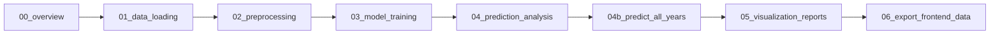

# 🌊 Coastal Assessment System using Sentinel-2 + Random Forest

> **Hackathon Project**: Analyze satellite images to detect coastal damage (seagrass loss, shoreline erosion) and provide evidence-based recommendations for government agencies.


---

## 📋 Table of Contents

- [Overview](#overview)
- [Project Structure](#project-structure)
- [Prerequisites](#prerequisites)
- [Installation Guide](#installation-guide)
- [Quick Start](#quick-start)
- [Workflow](#workflow)
- [Notebook Details](#notebook-details)
- [Frontend Dashboard](#frontend-dashboard)
- [Troubleshooting](#troubleshooting)
- [Team Collaboration](#team-collaboration)

---

## 🎯 Overview

This system uses **Copernicus Sentinel-2** satellite imagery and a **Random Forest Classifier** to:

- Compute multi-spectral indices (NDVI, NDWI, BAI) and spatial neighborhood features
- Classify coastal pixels into 5 classes: Seagrass, Sand, Seaweed, Water, Landmass
- Track area changes year-by-year from **2020 to 2025**
- Visualize results through an interactive **web dashboard**
- Generate evidence-based reports for policy makers

**Key Features:**

- ✅ Modular Jupyter notebooks (organized in `notebooks/` folder)
- ✅ **21-feature spatial model** — 7 spectral bands + 3×3 neighborhood means & stds
- ✅ **93.1% test accuracy** on Random Forest classifier
- ✅ Multi-year trend analysis (2020–2025)
- ✅ Area calculations in m², hectares, and km²
- ✅ **Interactive web dashboard** for presenting results
  ├── models/ # 🤖 Trained models & metadata
  ├── results/ # 📈 Classification maps & reports
  ├── outputs/ # 📂 Intermediate outputs
  ├── docs/ # 📖 Documentation
  └── README.md # This file

````

**For detailed structure documentation, see:** [`docs/PROJECT_STRUCTURE.md`](docs/PROJECT_STRUCTURE.md)

---

## 🔧 Prerequisites

### System Requirements

- **OS**: Windows 10/11 (Mac/Linux also supported)
- **RAM**: 8GB minimum (16GB recommended)
- **Storage**: 2GB free space
- **Internet**: For downloading packages

### Required Software

1. **Python 3.12** (⚠️ Important: use Python 3.12 for best compatibility with rasterio and scikit-learn)
2. **Git** (for version control)
3. **VS Code** (recommended) or Jupyter Notebook

---

## 📥 Installation Guide

### Step 1: Check Your Python Version

```powershell
python --version
# OR
py --version
````

**⚠️ CRITICAL**: Use Python 3.12. Newer versions (3.13+) may have compatibility issues with rasterio and scikit-learn.

### Step 2: Install Python 3.12 (if needed)

1. Download Python 3.12.8: https://www.python.org/downloads/release/python-3128/
2. Run installer and check:
   - ✅ "Add Python 3.12 to PATH"
   - ✅ "Install for all users" (optional)
3. Verify installation:
   ```powershell
   py -3.12 --version
   ```

### Step 3: Clone the Repository

```powershell
git clone <your-repo-url>
cd matlabTiff
```

### Step 4: Create Virtual Environment

**Why?** Keeps dependencies isolated and prevents conflicts.

```powershell
# Create virtual environment with Python 3.12
py -3.12 -m venv .venv

# Activate it
.\.venv\Scripts\activate

# You should see (.venv) in your terminal prompt
```

### Step 5: Install Required Packages

```powershell
# Upgrade pip first
python -m pip install --upgrade pip

# Install all dependencies
pip install numpy pandas matplotlib rasterio scikit-learn scipy joblib geopandas ipykernel

# This will take 3-5 minutes
```

**Packages Installed:**

| Package        | Version | Purpose                             |
| -------------- | ------- | ----------------------------------- |
| `numpy`        | 2.4.2   | Numerical computations              |
| `pandas`       | 3.0.1   | Data manipulation                   |
| `matplotlib`   | 3.10.8  | Visualizations                      |
| `rasterio`     | 1.5.0   | Read/write satellite TIFF files     |
| `scikit-learn` | 1.8.0   | Random Forest + preprocessing       |
| `scipy`        | 1.17.1  | Spatial filters (majority, uniform) |
| `joblib`       | 1.5.3   | Model serialization                 |
| `geopandas`    | 1.1.2   | Geospatial data handling            |
| `ipykernel`    | —       | Jupyter notebook support            |

### Step 6: Register Jupyter Kernel

```powershell
python -m ipykernel install --user --name=.venv --display-name="Python 3.12 (Coastal RF)"
```

### Step 7: Verify Installation

```powershell
python -c "import sklearn; import rasterio; print(f'✅ scikit-learn {sklearn.__version__}'); print(f'✅ rasterio {rasterio.__version__}')"
```

**Expected Output:**

```
✅ scikit-learn 1.8.0
✅ rasterio 1.5.0
```

---

## 📁 Project Structure

```
matlabTiff/
├── notebooks/                         # 🔬 Analysis workflow (00–06)
│   ├── 00_overview.ipynb              # Project overview & setup check
│   ├── 01_data_loading.ipynb          # Load Sentinel-2 bands
│   ├── 02_preprocessing.ipynb         # Compute NDVI, NDWI, BAI; build processed image
│   ├── 03_model_training.ipynb        # Train Random Forest model (21 spatial features)
│   ├── 03b_cnn_comparison.ipynb       # (Optional) CNN comparison experiment
│   ├── 04_prediction_analysis.ipynb   # Predict & visualize 2025 reference map
│   ├── 04b_predict_all_years.ipynb    # Batch classify years 2020–2025
│   ├── 05_visualization_reports.ipynb # Multi-year trend charts & reports
│   └── 06_export_frontend_data.ipynb  # Export JSON & PNGs for web dashboard
│
├── data/
│   ├── raw/
│   │   └── coastalImage/              # 2025 Sentinel-2 training images (B02–B08.tiff)
│   ├── years/                         # Year-specific satellite data
│   │   ├── 2020/ … 2025/
│   ├── processed/
│   │   └── processed_image_with_indices.tif  # 7-band stacked image
│   ├── training/                      # Ground-truth training samples (CSV)
│   └── aoi/                           # Area of Interest shapefiles
│
├── models/
│   ├── coastal_classifier_model.pkl   # Trained Random Forest (21-feature)
│   ├── feature_scaler.pkl             # StandardScaler
│   └── model_metadata.json            # Accuracy, feature names, class info
│
├── results/
│   ├── final_classification_map.tif   # GeoTIFF (QGIS-compatible)
│   ├── final_area_report.csv          # Area statistics per class
│   └── year_stats.json                # Pixel counts for all years (2020–2025)
│
├── outputs/                           # Intermediate outputs & visualizations
│
├── FRONTEND/                          # 🌐 Interactive web dashboard
│   ├── index.html
│   ├── style.css
│   ├── app.js
│   └── data/
│       ├── classified_2020.png … classified_2025.png
│       ├── area_stats.json
│       ├── trend_data.json
│       └── eco_summaries.json
│
├── docs/                              # 📖 Documentation
├── .venv/                             # Virtual environment (don't commit)
└── README.md                          # This file
```

---

## 🚀 Quick Start

### For VS Code Users

1. **Open the project folder in VS Code**

   ```powershell
   code .
   ```

2. **Install Jupyter extension** (if not installed)
   - Search "Jupyter" in Extensions (Ctrl+Shift+X)
   - Install by Microsoft

3. **Activate the virtual environment**

   ```powershell
   .venv\Scripts\activate
   ```

4. **Open a notebook** and select the correct kernel
   - Click the kernel selector (top-right corner)
   - Choose the `.venv` Python 3.12 interpreter
   - ⚠️ This is crucial! Wrong kernel = import errors

5. **Run the notebooks in order**
   - Start with `00_overview.ipynb` through `06_export_frontend_data.ipynb`

### View the Web Dashboard

Open `FRONTEND/index.html` directly in your browser, or use a local server:

```powershell
# From the FRONTEND folder
python -m http.server 8000
# Then open http://localhost:8000 in your browser
```

---

## 🔄 Workflow

### Step-by-Step Guide



## 📓 Notebook Details

| Notebook                           | Purpose                                                | Key Output                                                 |
| ---------------------------------- | ------------------------------------------------------ | ---------------------------------------------------------- |
| **00_overview.ipynb**              | Introduction & setup check                             | —                                                          |
| **01_data_loading.ipynb**          | Load & visualize Sentinel-2 bands                      | Band PNGs                                                  |
| **02_preprocessing.ipynb**         | Compute NDVI, NDWI, BAI; stack 7-band image            | `processed_image_with_indices.tif`                         |
| **03_model_training.ipynb**        | Train Random Forest with 21 spatial features           | `coastal_classifier_model.pkl`, `feature_scaler.pkl`       |
| **03b_cnn_comparison.ipynb**       | Optional CNN benchmark comparison                      | `cnn_coastal_classifier.keras`                             |
| **04_prediction_analysis.ipynb**   | Classify 2025 reference image, visualize, save GeoTIFF | `final_classification_map.tif/png`                         |
| **04b_predict_all_years.ipynb**    | Batch classify years 2020–2025, spectral refinement    | `classified_YYYY.png`, `year_stats.json`                   |
| **05_visualization_reports.ipynb** | Multi-year trend charts & area reports                 | Trend charts, CSV reports                                  |
| **06_export_frontend_data.ipynb**  | Export JSON data & images for web dashboard            | `area_stats.json`, `trend_data.json`, `eco_summaries.json` |

**Total Runtime**: ~30–45 minutes for complete pipeline

---

## 📊 Expected Results

After running all notebooks, you'll have:

1. **Trained Model**: `models/coastal_classifier_model.pkl` (Random Forest, 21 features, **93.1% accuracy**)
2. **Processed Image**: `data/processed/processed_image_with_indices.tif` (7-band stacked)
3. **Classified Maps**: `FRONTEND/data/classified_2020.png` through `classified_2025.png`
4. **Statistics**: `results/year_stats.json` — pixel counts per class per year
5. **Frontend Data**: `area_stats.json`, `trend_data.json`, `eco_summaries.json`
6. **GeoTIFF**: `results/final_classification_map.tif` (QGIS-compatible)

---

## 🐛 Troubleshooting

### Common Issues & Solutions

#### ❌ `ModuleNotFoundError: No module named 'rasterio'` (or sklearn/scipy)

**Cause**: Wrong kernel selected or packages not installed in `.venv`

**Solution**:

```powershell
# Activate the virtual environment
.\.venv\Scripts\activate

# Verify packages are installed
pip list | findstr rasterio
pip list | findstr scikit-learn

# Re-select kernel in VS Code:
# Click kernel selector → Choose the .venv interpreter
```

#### ❌ `FileNotFoundError: outputs/...`

**Cause**: `outputs/` folder doesn't exist

**Solution**: Already fixed in the notebooks. If it still happens:

```python
import os
os.makedirs('outputs', exist_ok=True)
```

#### ❌ `RuntimeError: cannot open file 'coastalImage/B02.tiff'`

**Cause**: Missing satellite images

**Solution**:

1. Ensure `coastalImage/` folder exists
2. Download Sentinel-2 images from Copernicus
3. Place B02.tiff, B03.tiff, B04.tiff, B08.tiff in the folder

#### ❌ Virtual Environment Not Activating

**PowerShell Solution**:

```powershell
# If you get execution policy error:
Set-ExecutionPolicy -ExecutionPolicy RemoteSigned -Scope CurrentUser

# Then activate:
.\.venv\Scripts\activate
```

#### ❌ `pip install` is Slow or Hangs

**Solution**:

```powershell
# Use --no-cache-dir flag
pip install rasterio --no-cache-dir

# Or specify timeout
pip install scikit-learn --timeout=1000
```

---

## 👥 Team Collaboration

### Git Workflow for Hackathon

**Recommended Approach**: Feature branches + Pull Requests

#### Initial Setup (Team Lead)

```powershell
# Create main repository
git init
git add .
git commit -m "Initial commit: Project structure"
git branch -M main
git remote add origin <your-repo-url>
git push -u origin main
```

#### For Team Members

```powershell
# Clone repository
git clone <your-repo-url>
cd matlabTiff

# Create feature branch
git checkout -b feature/<your-feature-name>

# Examples:
# git checkout -b feature/data-preprocessing
# git checkout -b feature/model-training
# git checkout -b feature/visualization

# Make changes, then:
git add .
git commit -m "feat: Add data preprocessing notebook"
git push origin feature/<your-feature-name>

# Create Pull Request on GitHub for team review
```

#### Branch Strategy

```
main (protected)
├── feature/data-loading
├── feature/preprocessing
├── feature/model-training
├── feature/analysis
└── feature/visualization
```

### Files to `.gitignore`

Create `.gitignore` file:

```gitignore
# Virtual Environment
.venv/
venv/
coastal_env/

# Outputs (too large, regenerate locally)
outputs/*.pkl
outputs/*.h5
outputs/*.png
outputs/*.csv

# Python
__pycache__/
*.py[cod]
*.so

# Jupyter
.ipynb_checkpoints/
*.ipynb_checkpoints

# IDE
.vscode/
.idea/

# System
.DS_Store
Thumbs.db
```

### Code Review Checklist

Before merging Pull Requests:

- [ ] Notebooks run without errors
- [ ] Code is commented and clear
- [ ] Outputs are properly saved
- [ ] No hardcoded paths (use relative paths)
- [ ] README is updated if needed

---

## 📈 Dataset Information

### Sentinel-2 Bands Used

| Band | Name  | Wavelength | Resolution | Use Case          |
| ---- | ----- | ---------- | ---------- | ----------------- |
| B02  | Blue  | 490 nm     | 10m        | Water bodies      |
| B03  | Green | 560 nm     | 10m        | Vegetation        |
| B04  | Red   | 665 nm     | 10m        | Vegetation stress |
| B08  | NIR   | 842 nm     | 10m        | Vegetation health |

### Spectral Indices Used

| Index | Formula                          | Purpose                               |
| ----- | -------------------------------- | ------------------------------------- |
| NDVI  | `(NIR - Red) / (NIR + Red)`      | Vegetation health (seagrass, seaweed) |
| NDWI  | `(Green - NIR) / (Green + NIR)`  | Water body detection                  |
| BAI   | `1 / ((0.1-Red)² + (0.06-NIR)²)` | Bare/sandy area detection             |

### Classification Classes

| Class | Name     | Color     | Spectral Signature                |
| ----- | -------- | --------- | --------------------------------- |
| 1     | Seagrass | 🟢 Green  | Moderate NDVI, shallow water      |
| 2     | Sand     | 🟠 Orange | Bright visible bands, low NDWI    |
| 3     | Seaweed  | 🟣 Purple | Moderate NDVI, darker water areas |
| 4     | Water    | 🔵 Blue   | Low NDVI, high NDWI               |
| 5     | Landmass | ⬜ Grey   | High NDVI, very low NDWI          |

---

## 🌐 Frontend Dashboard

The project includes an interactive web dashboard at `FRONTEND/index.html` that displays:

- **Year-by-year classified maps** (2020–2025)
- **Area statistics** per coastal class per year
- **Trend charts** showing ecosystem changes over time
- **Ecosystem health summaries**

To update the dashboard after reprocessing:

1. Run `04b_predict_all_years.ipynb` to regenerate classified images
2. Run `06_export_frontend_data.ipynb` to update JSON data files
3. Refresh the browser (Ctrl+F5)

---

## 🎓 For Presentation

### Key Points to Highlight

1. **Problem Statement**
   - Coastal degradation (seagrass loss, erosion)
   - Need for automated monitoring system

2. **Solution**
   - Sentinel-2 satellite data (free, high-res, 10m resolution)
   - Random Forest classifier with 21 spatial features
   - NDVI, NDWI, BAI spectral indices + 3×3 neighborhood context

3. **Technical Stack**
   - Python 3.12
   - Scikit-learn (Random Forest)
   - Rasterio (geospatial data)
   - SciPy (spatial filtering)
   - Interactive FRONTEND web dashboard

4. **Results**
   - Model accuracy: **93.1%** (Random Forest, 21 features)
   - Area calculations in m², ha, and km²
   - Multi-year trend detection (2020–2025)
   - Interactive web dashboard for evidence-based recommendations

### Demo Tips

Run notebooks in this order during demo:

1. Show `00_overview.ipynb` → Explain workflow
2. Run `01_data_loading.ipynb` → Show satellite bands
3. Run `02_preprocessing.ipynb` → Explain NDVI, NDWI, BAI
4. Run `03_model_training.ipynb` → Show Random Forest training (93.1% accuracy)
5. Run `04_prediction_analysis.ipynb` → Show 2025 prediction map
6. Run `04b_predict_all_years.ipynb` → Show all years 2020–2025
7. Run `06_export_frontend_data.ipynb` → Export to dashboard
8. Open `FRONTEND/index.html` → Show live web dashboard

---

## 📞 Support

### Team Contacts

- **Project Lead**: [Your Name]
- **Repository**: [Your GitHub URL]
- **Issues**: Create GitHub Issues for bugs/questions

### Useful Resources

- [Sentinel-2 Data](https://scihub.copernicus.eu/)
- [Scikit-learn Docs](https://scikit-learn.org/)
- [Rasterio Docs](https://rasterio.readthedocs.io/)
- [NDVI Explanation](https://en.wikipedia.org/wiki/Normalized_difference_vegetation_index)

---

## 📝 License

MIT License - Feel free to use and modify for your hackathon!

---

## 🎉 Credits

Developed for [Hackathon Name] by [Team Name]

**Team Members**:

- [Member 1] - Data preprocessing
- [Member 2] - Model training
- [Member 3] - Visualization
- [Member 4] - Analysis & reporting

---

## 🔄 Updates & Changelog

### Version 2.0 (Current)

- ✅ Complete 9-notebook pipeline (00–06)
- ✅ Random Forest with 21 spatial features (93.1% accuracy)
- ✅ NDVI, NDWI, BAI spectral indices
- ✅ Spectral refinement post-processing
- ✅ Multi-year classification (2020–2025)
- ✅ Interactive web dashboard (FRONTEND/)
- ✅ JSON export for frontend data
- ✅ GeoTIFF output (QGIS-compatible)

### Planned Enhancements

- [ ] Cloud masking using SCL band
- [ ] Real-time monitoring integration
- [ ] Additional years and regions

---

**Happy Hacking! 🚀🌊**

_Last Updated: March 10, 2026_
